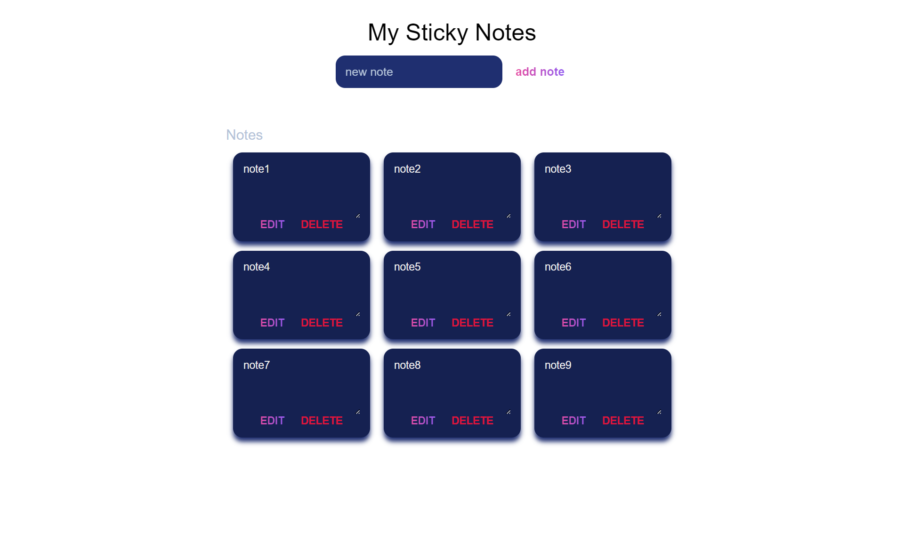

# Sticky notes app

## Welcome! 👋

Thanks for checking out my project.

## The challenge

the challenge was making a dummy sticky notes app with Javascript

1. No user login
2. No saved notes
3. Adding buttones for deleting and editing notes

*screenshot*

*preview*
https://brilliant-douhua-7003a4.netlify.app/

## What I learned

in this challenge i learned hou to creat html elements with javascript and assign css classes to them

### Continued development

In the next projects i'll focus more on adding different features to my apps , like user login , drag and drop ... and i'll start react js , vanilla js or next js.

## Author
[MOHAMMED ZAYDAN](https://www.linkedin.com/in/mohammed-zaydan/)

  
