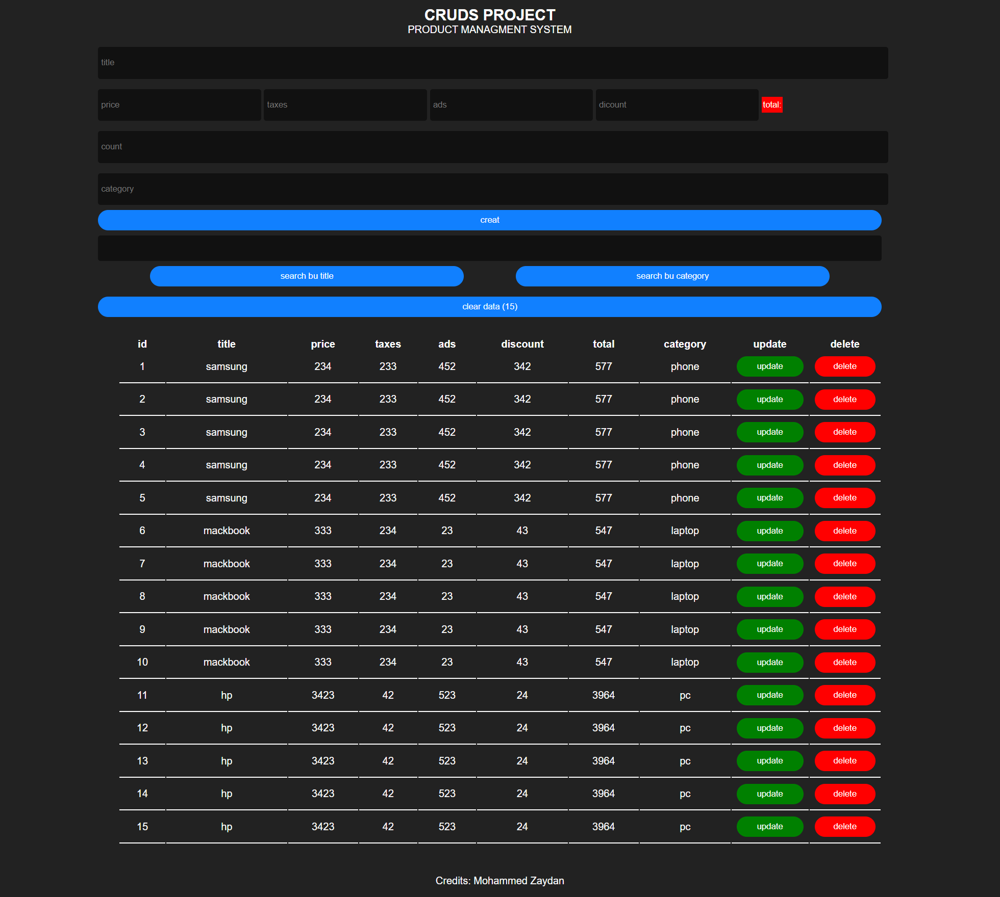

# Products Management app

## Welcome! 👋

Thanks for checking out my project.

## The challenge

the challenge was making a products management app with Javascript

1. Local storage
2. Creat , read , update , deletes , searche products

*screenshot*

*preview*
https://brilliant-douhua-7003a4.netlify.app/

### Continued development

In the next projects i'll focus more on adding different features to my apps , like user login , drag and drop ... and i'll start react js , vanilla js or next js.

## Author
[MOHAMMED ZAYDAN](https://www.linkedin.com/in/mohammed-zaydan/)
